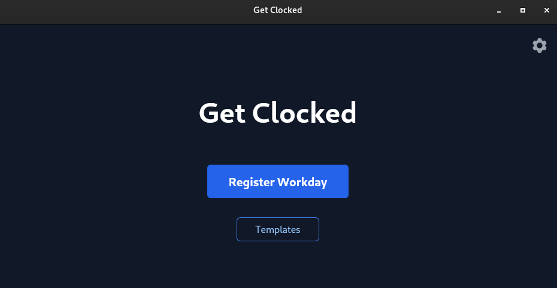
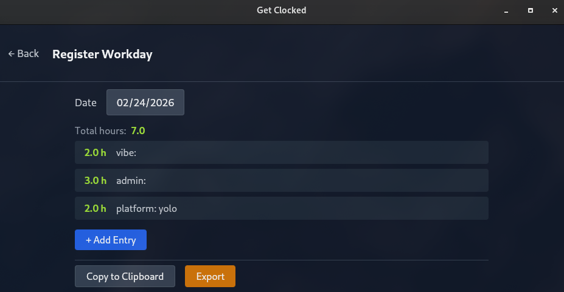

# Get Clocked

A cross-platform desktop time-tracking app built with Tauri 2 and a Rust/WASM frontend. Available for Linux, Windows, and macOS.

## Screenshots

### Home


### Register Workday


## Features

- Register daily work entries with hours and user-defined category tags
- Live total-hours display
- Copy workday data to clipboard as TSV
- Export to CSV or XLSX — files named `workday_{date}.csv` / `workday_{date}.xlsx`
- Optionally append entries to a running monthly overview sheet (`monthly_{YYYY-MM}.csv` / `.xlsx`)
- Create reusable category templates via the Template Maker page
- Template selector in the draft entry form pre-populates categories from a saved template
- Define reusable category names and allowed values via the Category Manager page
- Import category definitions from existing CSV/XLSX files
- Persistent settings: export folder, export format, and template folder

## Tech Stack

| Technology | Role |
|---|---|
| Tauri 2 | Native app shell |
| Rust + WASM (Trunk) | Frontend compiled to WebAssembly |
| `dominator` | Reactive DOM builder |
| `dwind` | Tailwind-style utility CSS |
| `futures-signals` | Reactive state/signals |
| `rust_xlsxwriter` + `csv` | File export (XLSX and CSV) |
| `calamine` | Read CSV/XLSX for category import |

## Project Structure

```
Cargo.toml          # Workspace root
frontend/
  src/lib.rs        # Frontend entrypoint (WASM)
  index.html        # Trunk entry point
  Trunk.toml        # Trunk config (serves :8080, builds to dist/)
src-tauri/
  src/main.rs       # Tauri backend entrypoint
  tauri.conf.json   # App config
```

## Getting Started

**Prerequisites:**

- Rust toolchain (`rustup`) with the `wasm32-unknown-unknown` target (`rustup target add wasm32-unknown-unknown`)
- `trunk` — WASM bundler: `cargo install trunk`
- Tauri CLI: `cargo install tauri-cli`
- Linux only: system libraries
  ```sh
  sudo apt-get install -y \
    libwebkit2gtk-4.1-dev \
    libappindicator3-dev \
    librsvg2-dev \
    patchelf
  ```

**Dev commands:**

```sh
# Run the full app (native window + Trunk dev server)
cargo tauri dev

# Frontend only (browser at http://localhost:8080)
cd frontend && trunk serve

# Production build
cargo tauri build
```

## CI/CD

- **CI** — Builds and verifies on Linux, Windows, and macOS on every push to `main`
- **Release** — Triggered by version tags (`v*`), creates a GitHub Release with platform binaries (AppImage, .exe, .dmg)

## App Window

- Size: 900×600
- Theme: dark
- Version: 0.1.3
